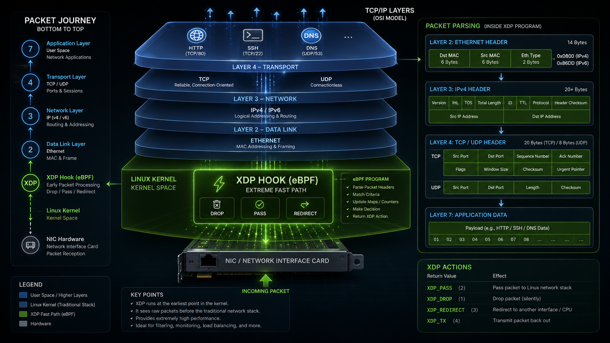

# XDP Network Protocol Monitor (Intermediate Level)


*High-level architecture showing XDP's extremely fast path in the Linux kernel and the step-by-step packet parsing process.*

## Overview
As illustrated in the architectural diagram above, this project leverages the power of **eBPF** and **XDP (eXpress Data Path)** to intercept network packets at the earliest possible stage—directly after they arrive at the Network Interface Card (NIC). 

By operating below the traditional Linux network stack, the XDP program can parse raw Ethernet frames (L2), IPv4 headers (L3), and TCP/UDP transport layers (L4) with near-zero latency. This allows us to classify and monitor specific application traffic (such as HTTP, SSH, and DNS) with extreme speed and minimal CPU overhead.

## Introduction
This project builds a fast network tool using **eBPF** and **XDP**. The main goal is to watch network traffic and count packets for specific protocols like **HTTP, SSH, and DNS** without slowing down the system.


## Why this project?(using Map)
Instead of printing every packet to the screen (which slows down the system), our project uses **BPF Maps** to store data.
* **Very Fast:** It counts packets at high speed.
* **Low System Load:** It does not waste CPU power by printing logs.
* **Real-time Data:** It gives us accurate, up-to-date numbers for our traffic.


## Getting Started

### 1. Set up the project
Clone the repository and go to the source folder:
```bash
git clone https://github.com/Puami/xdp-protocol-classifier.git
cd xdp-protocol-classifier/containerlab/xdp-project-e1
```
### 2. Deploy the environment
Start the network containers:
```bash
sudo containerlab deploy -t xdp-lab.clab.yml
```

### 3. Compile and Attach
Compile the code and attach it to the network interfaces:
```bash
cd src
make
#Note: This generates the classifier.bpf.o file required for loading
```
### 4. Attach XDP to Network Interfaces
Attach the compiled eBPF program to the eth1 interface on both nodes:
```bash
# Attach to Node 1
docker exec clab-xdp-lab-node1 bash -c 'ip link set dev eth1 xdp obj /work/bpf/classifier.bpf.o sec xdp'

# Attach to Node 2
docker exec clab-xdp-lab-node2 bash -c 'ip link set dev eth1 xdp obj /work/bpf/classifier.bpf.o sec xdp'

#for detach ebpf program(for node2)
docker exec clab-xdp-lab-node2 bash -c 'ip link set dev eth1 xdp off'
```
> 💡 **Pro Tip: Split Your Terminal for Real-time Monitoring**
> Before proceeding to the next steps, it is highly recommended to split your terminal into two panes (using `tmux`, Terminator, or your terminal's built-in split feature). 
> * **Pane 1 (Node 1):** Use this to read the eBPF maps and monitor the real-time packet counters.
> * **Pane 2 (Node 2):** Use this to execute commands (`curl`, `ssh`, `dig`) and generate traffic.
> 
> This dual-pane setup allows you to observe the XDP classifier reacting to your traffic instantly!


### 5. Prepare the container
Install the necessary networking tools inside node2 to generate traffic:
```bash
docker exec -it clab-xdp-lab-node2 bash
apt update
apt install -y openssh-client curl dnsutils
```

### 6. Generate traffic and Monitor
After installing the tools on `node2`, you can generate traffic to the IP address of `node1` (10.0.3.1) and then check the results with other node.

1. **Generate traffic from node2 to node1:**
```bash
   # Test DNS
   dig @10.0.3.1
   
   # Test HTTP
   curl 10.0.3.1
   
   # Test SSH
   ssh 10.0.3.1
```

2. **View statistics:**
Check the counters in the eBPF map to see how many packets were caught for each protocol:
```bash
bpftool map dump name pkt_counts
```
The keys are mapped as follows: 0 for HTTP (port 80), 1 for SSH (port 22), and 2 for DNS (port 53)."

> 🔍 **Observation Note: Why does `dig` count 3 packets?**
> When you check the BPF map, you might notice that HTTP (curl) and SSH register exactly **1 packet**, while DNS (dig) registers **3 packets**. This is not a bug in the XDP program!
> * **TCP (curl/ssh):** Sends a SYN packet. Since the port is closed, it receives an RST packet and aborts immediately. (1 packet counted).
> * **UDP (dig):** UDP is connectionless. When `dig` fails to get a valid DNS response (getting an ICMP port unreachable instead), its default behavior is to retry the query. It attempts exactly 3 times before giving up. Because XDP sits at the lowest layer, it intercepts and correctly counts all 3 attempts!

### 7: Cleanup
Once you are finished, destroy the lab environment to free up system resources:
```bash
sudo containerlab destroy -t xdp-lab.clab.yml
```
## Execution Demonstration

The following screenshots demonstrate the XDP protocol classifier in action, capturing the state of the BPF map before and after generating network traffic.

**1. Initial State:** 
The eBPF program is successfully loaded, and the packet counters in the BPF map are initially empty (or at zero).


**2. Traffic Generation:** 
Sending HTTP, SSH, and DNS requests from `node2` to `node1` to trigger the kernel-level classification.


**3. Updated Statistics:** 
Dumping the BPF map after the traffic generation shows that the XDP program has successfully intercepted and counted the packets based on their respective protocols.


