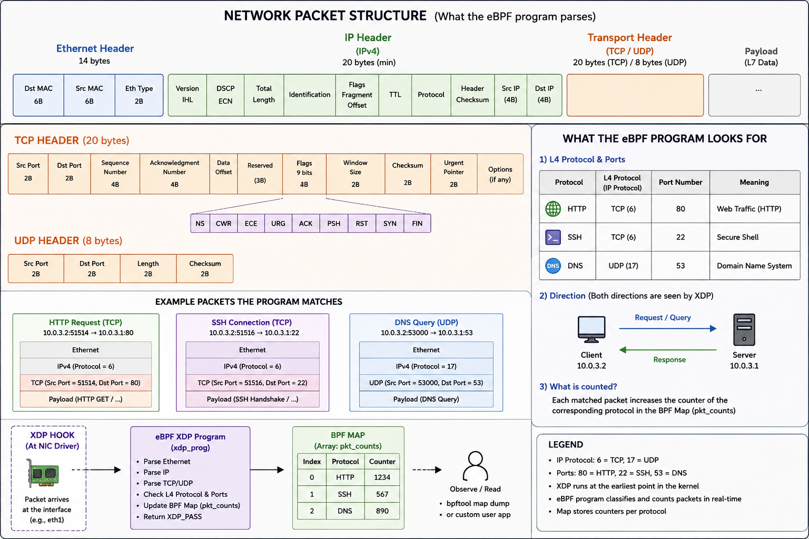
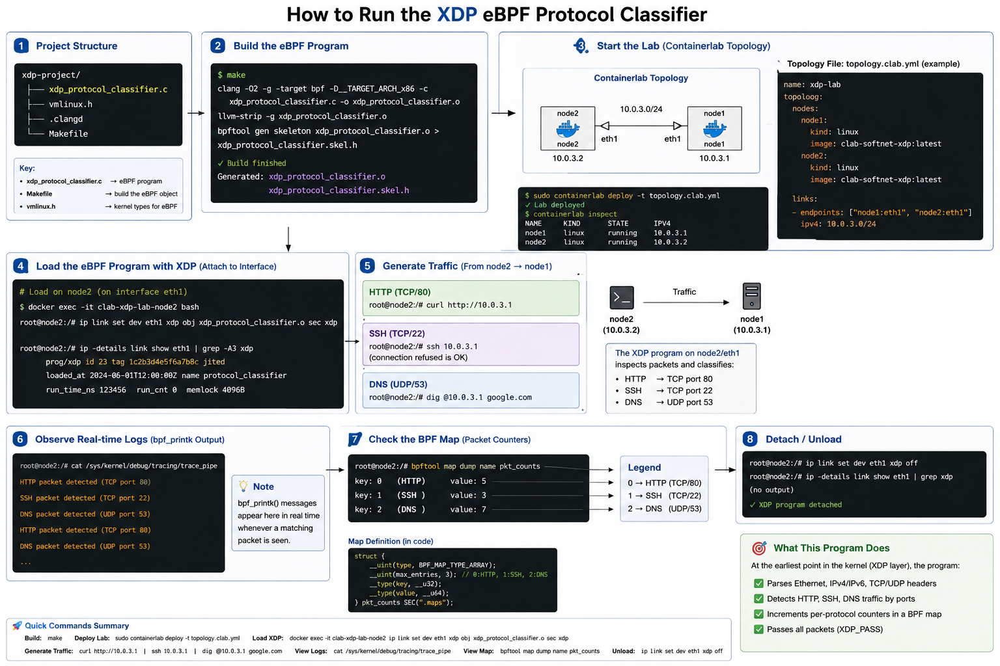
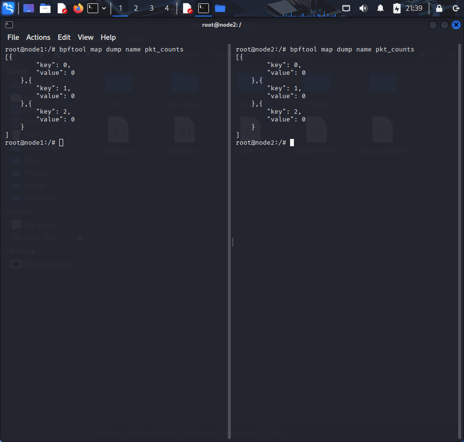
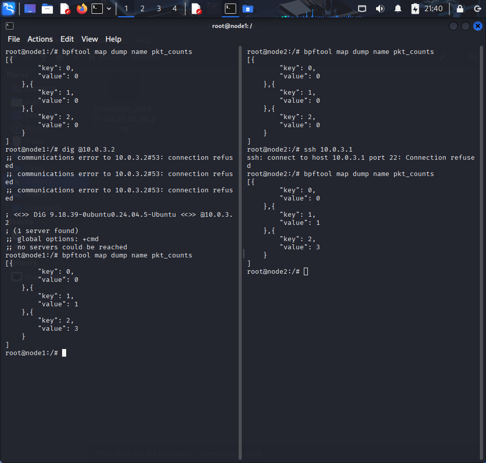
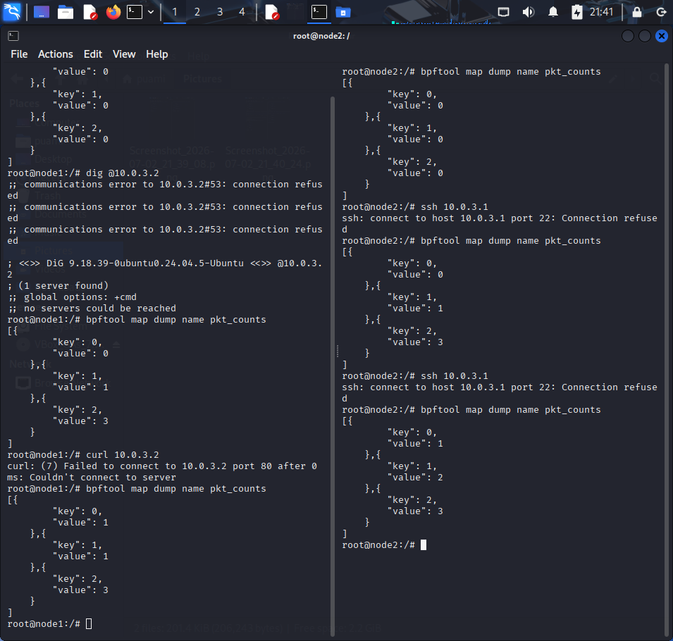

# XDP Network Protocol Monitor (Intermediate Level)

## Introduction
This project builds a fast network tool using **eBPF** and **XDP**. The main goal is to watch network traffic and count packets for specific protocols like **HTTP, SSH, and DNS** without slowing down the system.




## Why this project?(using Map)
Instead of printing every packet to the screen (which slows down the system), our project uses **BPF Maps** to store data.
* **Very Fast:** It counts packets at high speed.
* **Low System Load:** It does not waste CPU power by printing logs.
* **Real-time Data:** It gives us accurate, up-to-date numbers for our traffic.



## Getting Started

### 1. Set up the project
Clone the repository and go to the source folder:
```bash
git clone <https://github.com/Puami/xdp-protocol-classifier/tree/main>
cd containerlab/xdp-project-e1
```
### 2. Deploy the environment
Start the network containers:
```bash
sudo containerlab deploy -t xdp-lab.clab.yml
```

### 3. Compile and Attach
Compile the code and attach it to the network interfaces:
```bash
cd src
make
#Note: This generates the classifier.bpf.o file required for loading
```
### 4. Attach XDP to Network Interfaces
Attach the compiled eBPF program to the eth1 interface on both nodes:
```bash
# Attach to Node 1
docker exec clab-xdp-lab-node1 bash -c 'ip link set dev eth1 xdp obj /work/bpf/classifier.bpf.o sec xdp'

# Attach to Node 2
docker exec clab-xdp-lab-node2 bash -c 'ip link set dev eth1 xdp obj /work/bpf/classifier.bpf.o sec xdp'

#for detach ebpf program(for node2)
docker exec clab-xdp-lab-node2 bash -c 'ip link set dev eth1 xdp off'
```
### 5. Prepare the container
Install the necessary networking tools inside node2 to generate traffic:
```bash
docker exec -it clab-xdp-lab-node2 bash
apt update
apt install -y openssh-client curl dnsutils
```

### 6. Generate traffic and Monitor
After installing the tools on `node2`, you can generate traffic to the IP address of `node1` (10.0.3.1) and then check the results with other node.

1. **Generate traffic from node2 to node1:**
```bash
   # Test DNS
   dig @10.0.3.1
   
   # Test HTTP
   curl 10.0.3.1
   
   # Test SSH
   ssh 10.0.3.1
```

2. **View statistics:**
Check the counters in the eBPF map to see how many packets were caught for each protocol:
```bash
bpftool map dump name pkt_counts
```
The keys are mapped as follows: 0 for HTTP (port 80), 1 for SSH (port 22), and 2 for DNS (port 53)."

### 7: Cleanup
Once you are finished, destroy the lab environment to free up system resources:
```bash
sudo containerlab destroy -t xdp-lab.clab.yml
```
## Execution Demonstration

The following screenshots demonstrate the XDP protocol classifier in action, capturing the state of the BPF map before and after generating network traffic.

**1. Initial State:** 
The eBPF program is successfully loaded, and the packet counters in the BPF map are initially empty (or at zero).


**2. Traffic Generation:** 
Sending HTTP, SSH, and DNS requests from `node2` to `node1` to trigger the kernel-level classification.


**3. Updated Statistics:** 
Dumping the BPF map after the traffic generation shows that the XDP program has successfully intercepted and counted the packets based on their respective protocols.



